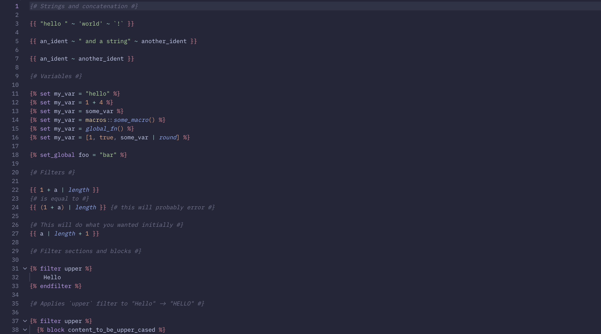

# vscode-tera

[Visual Studio Code](https://code.visualstudio.com/) extension & [TextMate](https://macromates.com/manual/en/language_grammars) grammar for the [Tera](https://keats.github.io/tera/) templating language.

_Visual Studio Code with vscode-tera. Screenshot taken with the [catppuccin/vscode](https://github.com/catppuccin/vscode) theme._

## License

> [!NOTE]
> The grammar of this extension was partially based on https://github.com/karuna/tera-vscode.

[MIT](LICENSE)
